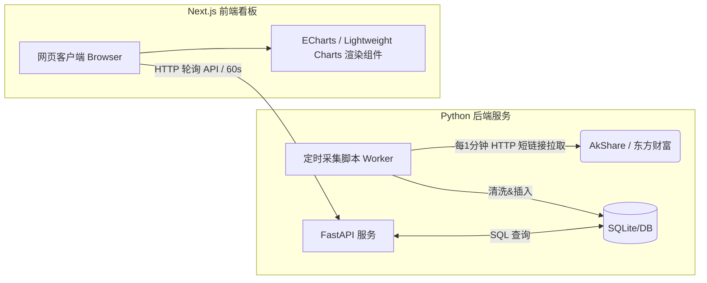

# A股板块主力资金流向实时 Web 看板 PRD

## 1. 文档信息
| 项目 | 详情 |
| :--- | :--- |
| **项目名称** | A股板块主力资金流向实时 Web 看板 |
| **版本号** | V3.0 (前后端分离 Web 版) |
| **技术栈 (后端)**| Python 3.12+, AkShare, SQLite/PostgreSQL, FastAPI (提供 API) |
| **技术栈 (前端)**| **Next.js** (React), TailwindCSS, ECharts / TradingView Lightweight Charts |
| **核心功能** | 盘中全市场数据高频轮询、分时数据 API 服务、TradingView 风格的实时可交互看板 |
| **目标用户** | 个人投资者、量化交易员、盯盘散户 |

## 2. 项目背景与目标
### 2.1 背景
传统的炒股软件对“板块内日资金流向”往往只提供单调的排名表格，缺乏直观的分时走势对比；而商用的高级量化看板（如 Wind、同花顺iFinD）价格昂贵。本项目旨在利用开源的 AkShare 接口，构建一个低成本、高性能的 Web 盯盘应用，提供类似 TradingView 的丝滑图表交互体验。

### 2.2 核心目标
1. **稳定采集**：后端构建独立的数据抓取守护进程，交易日每分钟获取一次资金横截面数据并落库。
2. **前后端分离**：后端通过 FastAPI 提供标准 RESTful API，输出结构化的时间序列数据。
3. **Web 交互可视化**：前端使用 Next.js 搭建响应式页面，实现多板块资金曲线叠加、图表缩放/平移（Zoom/Pan）、悬浮提示（Tooltip）等高级交互。
4. **实时刷新**：前端页面无需手动刷新，图表随盘中时间自动追加最新数据点。

---

## 3. 功能需求列表

### 3.1 数据采集服务 (Backend Worker)
| 功能点 | 优先级 | 描述 | 技术实现 |
| :--- | :--- | :--- | :--- |
| **盘中高频轮询** | P0 | 交易日内（9:30-11:30, 13:00-15:00）每分钟自动短链接拉取行业/概念数据 | Python `APScheduler` + AkShare |
| **数据清洗与落库** | P0 | 清洗合并、统一转换为“亿元”，打上时间戳后写入数据库 | Pandas + SQLite |

### 3.2 数据接口服务 (Backend API - FastAPI)
| 功能点 | 优先级 | 描述 | 路由定义 (示例) |
| :--- | :--- | :--- | :--- |
| **板块列表获取** | P0 | 返回当前数据库中存在的所有板块名称，供前端下拉框/复选框使用 | `GET /api/sectors` |
| **分时资金流向** | P0 | 接收前端传入的板块列表和日期，返回标准化的时间序列数据（按分钟） | `POST /api/fund_flow/intraday` |
| **最新资金排名** | P1 | 返回当前（最新一分钟）的资金净流入/流出 TOP10 板块 | `GET /api/fund_flow/ranking` |

### 3.3 前端看板模块 (Frontend - Next.js)
| 功能点 | 优先级 | 描述 | 界面/交互 |
| :--- | :--- | :--- | :--- |
| **可交互资金折线图** | P0 | 主界面图表。横轴为交易时间（9:30-15:00），纵轴为净流入金额（亿元）。支持多条板块曲线同框对比显示 | TradingView 风格，支持鼠标滚轮缩放、拖拽平移、十字准星数据提示 |
| **自选板块池切换** | P0 | 图表侧边栏提供板块搜索与多选框，勾选后图表即时增加该板块的资金曲线 | 多选 Tag 标签组件 |
| **图表自动更新** | P1 | 前端页面开启定时器（或基于 SWR/React Query），每隔 60 秒拉取增量/全量数据，图表平滑重绘 | `useSWR` 轮询 |
| **涨跌配色标注** | P1 | 终点数据标注：资金净流入（>0）显示红色，净流出（<0）显示绿色 | ECharts Label 样式定制 |

---

## 4. 系统架构与技术链路

### 4.1 整体架构图


### 4.2 数据接口交互示例 (JSON)
前端请求 `POST /api/fund_flow/intraday`
```json
// Request Body
{
  "date": "2026-05-09",
  "sectors":["半导体", "白酒", "机器人"]
}

// Response Body
{
  "code": 200,
  "timestamps":["09:30:00", "09:31:00", "09:32:00"],
  "series":[
    { "name": "半导体", "data": [1.2, 2.5, 3.1] },
    { "name": "白酒", "data": [-0.5, -1.2, -0.8] },
    { "name": "机器人", "data": [0.8, 1.1, 2.0] }
  ]
}
```

---

## 5. 前端图表选型建议

为了实现“类似 TradingView”的体验，放弃 Matplotlib，推荐以下两种前端图表方案，开发时二选一：

1. **Apache ECharts (首选，极力推荐)**
   * **优势**：极度适合做“多条折线叠加”的分析对比图；自带开箱即用的 DataZoom（底部缩放条）、Tooltip（十字光标联动悬浮窗）、Legend（图例开关），生态对 React/Next.js 支持极好（如 `echarts-for-react`）。
2. **TradingView Lightweight Charts**
   * **优势**：纯正的 TradingView 视觉风格，金融质感拉满，性能极高。
   * **劣势**：它原生主要设计用于展现单一资产的 K线 (OHLCV)，在实现**多条无关联折线共同显示（共享Y轴）**时，配置起来比 ECharts 稍微繁琐一点。

---

## 6. 排期规划（前后端分离敏捷开发）

| 阶段 | 周期 | 核心任务 | 交付里程碑 |
| :--- | :--- | :--- | :--- |
| **第一阶段: 后端基建** | 第1-2天 | 搭建 Python 采集脚本、SQLite 建表；<br>开发 FastAPI 基础接口接口。 | 接口提供本地 mock 测试数据，能通过 Postman 调通 `/api/fund_flow/intraday` |
| **第二阶段: 数据积累** | 第3天 | **后端服务在盘中挂机** | 积累完整的真实分时测试数据 |
| **第三阶段: 前端搭骨架** | 第3-4天 | Next.js 初始化，引入 TailwindCSS 搭建页面布局；<br>集成 ECharts，打通前后端接口联调。 | 页面可显示图表，成功渲染静态 API 数据 |
| **第四阶段: 交互优化** | 第5天 | 实现侧边栏板块搜索/筛选联动；<br>配置图表 Zoom/Pan 和十字光标。 | 勾选侧边栏板块，图表立即响应新增对应曲线 |
| **第五阶段: 实时特性** | 第6天 | 前端基于 SWR 或 `setInterval` 实现每分钟静默拉取更新 API；<br>图表实现无刷新追加最新时间点。 | 完成完整的盘中盯盘体验 |

---

## 7. 风险与非功能需求

### 7.1 并发与性能
* **前端请求优化**：Next.js 端的数据轮询建议使用 SWR (`swr` 包) 实现，自带缓存和重验证机制，体验更丝滑。
* **数据库索引**：由于采用 SQLite，随着时间推移数据量增加，**必须对表中的 `更新时间` 和 `名称` 字段建立联合索引**，否则 FastAPI 在计算全天分时序列时会产生性能瓶颈（慢查询）。

### 7.2 采集风控防范（核心底线）
* **与原架构要求保持一致**：后端 Python 定时器**严禁低于 1 分钟/次**的请求频率。
* 前端无论有多少用户并发访问（打开了多少个浏览器网页），只会向自建的 FastAPI 后端拿数据，**绝对不会**增加对 AkShare（东方财富）源站的请求压力。这种架构非常安全可靠。

### 7.3 后续扩展 (未来版本规划)
1. **用户系统**：引入 NextAuth 支持用户登录，保存不同用户的“自选观察板块”组合（如：用户A保存“AI主线”，用户B保存“新能源主线”）。
2. **个股联动**：点击图表上的某条板块曲线（如半导体），右侧滑出侧边栏，展示当前时间点该板块内“资金净流入前5名的个股”，实现从板块到个股的穿透分析。